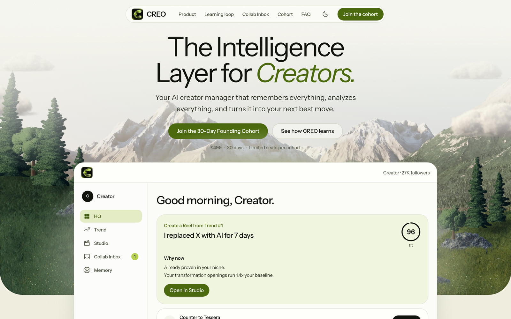
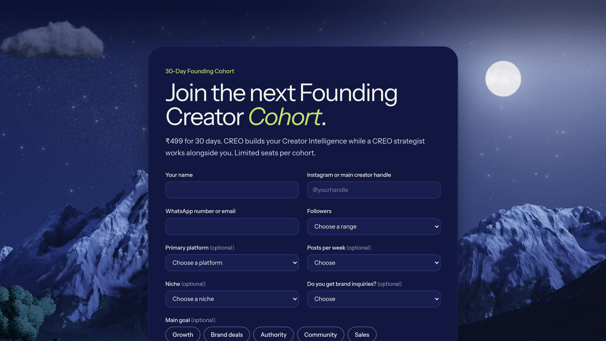

# CREO

The Intelligence Layer for Creators: an AI creator manager that remembers everything, analyzes everything, and turns it into your next best move. CREO learns a creator's content, audience, performance and deals, then recommends what to do next.

Live site: [trycreosi.vercel.app](https://trycreosi.vercel.app). The workspace behind it is invite-only for now (see [Workspace access](#workspace-access)).



This repo is the launch product from the *CREO 3-Day Launch + 30-Day Design Partner Plan*: a marketing site and a desktop-first web app with four systems.

| System | What it does |
|---|---|
| **HQ** | Morning brief, ranked next-best actions, Creator DNA, Memory, Approvals |
| **Trend** | Pattern extraction, creator-fit score with a visible breakdown, original adaptations, save to Studio |
| **Studio** | Trend or idea to hooks, script, shot plan, caption, CTA, titles, alternate openings (English and Hinglish) |
| **Collab Inbox Lite** | Paste a brand message, extract terms, flag risks, price it, draft a reply, approve |

Nothing public or commercial leaves CREO without an approval. Every approval, edit and result is written to Memory, and Memory changes the next draft.

## Run it

```bash
npm install
npm run dev          # http://localhost:3000  (landing)   /app  (workspace)
npm test             # engine and validation tests (Node's built-in runner)
npm run typecheck
npm run build && npm start
```

Node 20.9 or newer. Copy `.env.example` to `.env.local` and set `SUPABASE_URL`, `SUPABASE_PUBLISHABLE_KEY`, `CRON_SECRET` and `WORKSPACE_ACCESS_CODE` before deploying. Without `WORKSPACE_ACCESS_CODE` nobody can open `/app`, so set it locally too.

## Workspace access

For now `/app` (the workspace) is gated with one shared access code; the landing site and every other page stay public.

- `src/proxy.ts` (Next 16's renamed middleware) runs on `/app` and `/app/*`. A visitor without the access cookie is sent to `/access?next=<where they were going>`.
- `/access` asks for the code and posts it to `POST /api/access`. A right code sets the `creo_access` cookie (httpOnly, SameSite=Lax, Secure in production, 30 days) and the page goes where the visitor was heading. `next` can only ever point inside `/app`.
- The code lives in the server-only env var `WORKSPACE_ACCESS_CODE` (in Vercel: Project Settings, Environment Variables). The cookie holds an HMAC of the code, never the code. Codes are compared in constant time, and wrong guesses are rate limited per IP (8 per 15 minutes, best effort per server instance).
- **Change the code to sign everyone out.** If the variable is empty the gate stays shut: `/access` says the workspace is not open yet.
- "Clear what CREO saved in this browser" on `/cookies` also removes the access cookie, which locks the workspace again on that browser.

`src/lib/access.ts` holds the logic and `tests/access.test.ts` covers it. This is a stopgap for the invite-only phase, not accounts: everyone with the code is the same user, and workspace data still lives in each browser.

## Backgrounds

Every page is one `.day`: a single gradient from dawn to dusk behind the whole page, with a fine paper grain on top (`globals.css`, "Backgrounds"). Sections stay transparent and add one quiet decoration each: a motif (contours, a rising line, ripples), a treeline along the bottom edge, a soft glow behind the product, or, in the dark theme, a still star field and a faint aurora. Everything is static, and `/classic` does not use any of it.

The treeline, star and grain images are baked into `src/app/backdrop.css` by `node scripts/backdrop.mjs` (like `scripts/wind.mjs` for the trees). Edit the script and run it again; do not edit the CSS file.

## The scenery

The hero, the product page and the night section show one scene in two light settings, dawn and night: mountains, forest, lake, clouds, grassy banks with stones, and near trees that move in the wind. These are pictures in `public/scene`, baked by the scripts in `scripts/scenery` (see the README there). `src/components/scene/geometry.ts` says where the banks and trees stand, so the pictures and the page always agree, and `landscape.tsx` and `cloud.tsx` place them. `/classic` keeps its drawn SVG scene. To change the scene, edit a script and bake again; do not edit the `.webp` files.

The mountains are real terrain: elevation data from the US Geological Survey (public domain), rendered in 3D by `scripts/scenery/back.frag`.

The same scene a few scrolls later, at night: moon, stars, a cloud and the lake's far shore behind the cohort application.



Both pictures are screenshots of the production build.

## Stack

Next.js 16 (App Router), React 19, TypeScript, Tailwind v4, Motion, Phosphor icons, Instrument Sans (self-hosted via Fontsource). No UI kit, no state library, no test framework.

## How it is organised

```
src/lib/engine/   Pure TypeScript, no framework imports. This is the product logic.
  pricing.ts      Quote range, walk-away price, every step explained
  extract.ts      Brand message to terms, risk signals and highlight spans
  evaluate.ts     Deal health, counter terms, levers, reasoning
  draft.ts        Reply drafts (counter, ask questions, accept, decline)
  trend.ts        Pattern extraction, creator-fit scoring, adaptations, pattern library
  studio.ts       Package generator, with copy.ts holding the English and Hinglish grammar
  dna.ts          Creator DNA insights derived from past posts
  brief.ts        HQ brief and next-best-action ranking
src/lib/store/    Workspace reducer, localStorage persistence, sample workspace seed
src/lib/          access.ts (workspace gate), apply.ts and contact.ts (form validation), supabase.ts (REST insert), site.ts (contact details, social links)
src/proxy.ts      The workspace gate: /app and /app/* need the access cookie
src/components/
  product/        Shared product components, used by the app and the landing page
  landing/        Landing sections. They run the real engines on a sample creator.
  scene/          The painted landscape, clouds and glass tiles (server components, seeded, original art)
  ui/             Buttons, panels, the marker, fit ring, tickets, count-up, form fields
src/app/          Routes: / (landing), /product, /learning-loop, /collab-inbox, /cohort, /faq, /classic,
                  /about, /media, /contact, /terms, /privacy, /cookies (public pages and the footer's pages),
                  /access (the code page), /app/* (workspace, gated),
                  /api/apply, /api/contact, /api/access, /api/keepalive
tests/            Engine tests, form validation tests and access gate tests
```

The landing page does not use screenshots. Each section renders the same components and engines as the app, on a made-up sample creator, so what visitors try is what the product does.

## Design

See `docs/design-research.md` and `docs/design-direction.md`. The landing page is one day with CREO: a painted mountain-and-lake scene that moves from dawn (hero) to night (closing CTA) as you scroll, with the real product UI in front of it. Olive and lime on warm paper; the marker (a soft lime wash behind text) is CREO's own device and is only ever a fill, never a text color. Tokens live in `src/app/globals.css`; the scene in `src/components/scene/`. Shape rule: panels 24px, controls 12px, glass tiles 16px, tickets 28px, buttons and chips fully round.

## How the numbers work

- **Quote:** `max(₹1,000, average views / 1,000 x ₹500 x niche factor)` per Reel. Stories are 0.3x, static posts 0.6x, bundles of 3 or more get 5% off. Paid usage adds 30% (30 days) or 60% (90 days), perpetual usage 100%. Exclusivity adds 25% to 100% by length, a rush adds 20%. The range is the mid-point plus or minus 15%, rounded to ₹500. Walk-away is 75% of the mid-point. Your own minimum per Reel overrides a lower anchor.
- **Counter terms:** CREO prices the terms *you* would accept (your longest exclusivity and paid usage from Deal rules), separately from the terms the brand asked for.
- **Creator fit (0 to 100):** niche 20, hook history 25, format 20, length 10, voice 10, goal 15. Hook history compares your past posts for that hook type with your baseline views.
- **Niche factors, rates and weights are starting points.** Replace them with real deal data as the cohort produces it.

## Applications

`POST /api/apply` validates a founding-cohort application (`src/lib/apply.ts`), ignores a honeypot field, rate limits per IP (best effort, per server instance) and inserts a row into the Supabase table `cohort_applications` (schema in `supabase/migrations`). Read applications in the Supabase dashboard under Table Editor.

- The server talks to Supabase over REST with the publishable key, kept in server env vars. Row Level Security lets that key insert applications and nothing else: it cannot read, change or delete them.
- A daily Vercel cron (`vercel.json`) calls `/api/keepalive`, which runs one trivial query so a free-plan project is not paused for inactivity. It needs `CRON_SECRET`.
- Without Supabase, `CREO_APPLICATIONS_WEBHOOK` is used if set. With neither, applications go to `.data/applications.jsonl` in development and the route returns 503 in production, so a misconfigured deployment never silently drops applications.

The Contact Us page works the same way: `POST /api/contact` validates the message (`src/lib/contact.ts`), ignores a honeypot field, rate limits per IP and inserts a row into `contact_messages` (insert-only for the publishable key, like applications).

## What is not built yet

Kept out on purpose, per the plan's "do not build in 72 hours" list: Gmail integration, invoices, auto-publishing, native mobile apps, contract workflows, affiliate tracking, multi-creator workspaces.

Also not built yet:

- **Accounts and a database.** Workspace data lives in the browser (`localStorage`, key `creo.workspace.v1`), and access is one shared code (see Workspace access), not per-user sign-in. `src/lib/store/workspace.tsx` is the single place to swap in Supabase auth and Postgres.
- **A language model.** Generation is deterministic and template-based (`copy.ts`), so it is fast, explainable and testable, but it will not match a model's range. A model route can sit behind `buildPackage` and fall back to the local engine.
- **Screenshot reading.** Collab Inbox accepts pasted text and `.txt` or `.eml` files. Reading screenshots needs a vision model.
- **A live trend feed.** The pattern library is curated by hand (`LIBRARY` in `trend.ts`) and creators add saved Reels by describing them. CREO does not scrape Instagram.
- **A strategist console.** Corrections from the creator are captured today. A separate strategist role is a next step.
