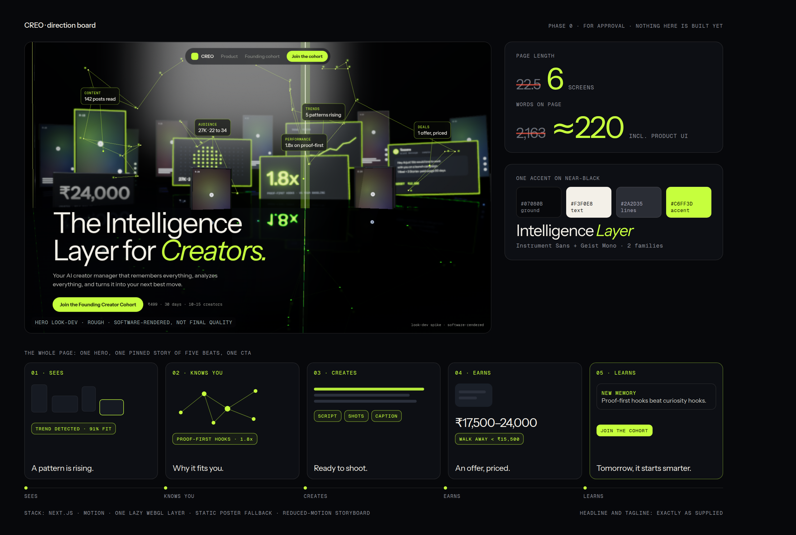
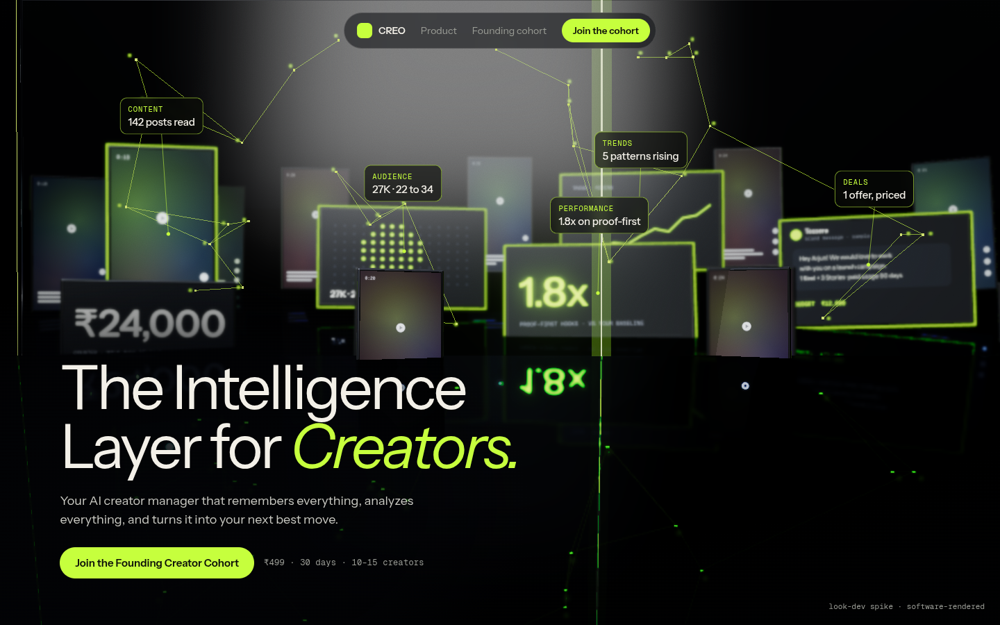

# CREO design direction (Phase 0)

Status: for approval. Nothing here is built. Supersedes `design-direction.md` and `design-research.md` for the landing page (those describe the previous light, painted-scene page).
Date: 2026-10-02 · Companion image: `docs/assets/direction-board.png`

## 0. What was and was not verified

| Item | Status |
|---|---|
| The ten original references and the eight new ones (Unseen, Makemepulse, Fantasy, Lusion, Basement, Codrops, three.js, Passionfroot, Attio, Descript, ...) | **Not inspected.** Every one of these hosts is blocked from this environment. Section 4 states lessons from your brief and general knowledge, marked as unverified. Nothing here says "I looked at their current site" |
| Current CREO site | Measured on the production build (section 2) |
| Next.js behaviour | Read from the docs bundled in `node_modules/next/dist/docs` (as the repo's `AGENTS.md` requires) |
| WebGL in this environment | **Verified.** WebGL2 runs (software, SwiftShader). A look-dev scene rendered and screenshotted. Frame times are software numbers and say nothing about real GPUs |
| Library bundle sizes | **Measured** with esbuild (gzip -9), section 8 |
| motion-primitives and Magic UI | **Source files fetched and read** (appendix B) |
| Open-source product repos (Twenty, Plane, Midday, AFFiNE, Penpot, LibreChat, Dub, Trigger.dev) | README level only. No source trees or screenshots (appendix C) |
| Real-device performance, Safari/iOS WebGL | **Unverified.** Needs a phone and a laptop (section 12) |
| Image generation (`imagegen-frontend-web`) and Figma/Canva sync | Not available: the image service refused to connect, and `/design-sync` needs a design project from you. The board is built in code instead |

## 1. The brief, decoded

You want: **far less text**, a **short** first page a stranger understands in about a minute, a hero that feels **real** and is **very creative**, and the supplied words used exactly.

Locked copy (verbatim, not to be edited):

> **The Intelligence Layer for Creators.**
> Your AI creator manager that remembers everything, analyzes everything, and turns it into your next best move.

Rules this implies:

1. The hero is the explanation. Everything below it only proves the tagline's three verbs: **remembers**, **analyzes**, **turns it into your next best move**.
2. One page, one scroll story, one call to action. Anything that does not prove a verb leaves the first page.
3. Real product UI beats decoration, always. Sample data is labelled as sample.

## 2. Audit of the current site

Measured on the production build with Playwright (1440x900 and 390x844):

| | Now | Target |
|---|---|---|
| Page height | **22.5 screens** (desktop), 23.3 (mobile) | **6 screens** |
| Visible words | **2,163** | **about 220** (about 120 marketing, about 100 inside product samples) |
| Headings | 23 | 7 |
| Links and buttons | 75 | under 15 |
| Hero alone | 157 words, 1.6 screens | 28 words, 1 screen |

Where the words are: Collab 380, Trend 351, Cohort 274, HQ 205, Studio 205, DNA 166, Loop 152, Human 99, Proof 64.

**Keep:** the engines (Trend, Studio, Collab, DNA, brief) and the sample creator. They are the "real product" for the story. The `/app` workspace. The application form and `/api/apply`. Reduced-motion plumbing (`MotionConfig`).
**Retire from `/`:** the painted olive scene and all nine long sections. They stay in git history; `/app` is untouched.
**Open code facts from the Next docs that shape the build:**
- `ssr: false` is only allowed inside a Client Component, so the 3D hero needs a `"use client"` wrapper around `next/dynamic`.
- Dynamically importing a Client Component from a Server Component is not code-split, so the dynamic import lives in the client wrapper.
- Any `<video>` fallback needs `width`/`height` or `aspect-ratio` and a `poster`, or it shifts the layout.
- First render must match on server and client (we already hit this with reduced motion).

## 3. Visual thesis: "The Layer"

> Your content, audience and deals are scattered signals. **CREO is the clear layer that sits over them and reads them.**

This is the literal meaning of the headline, so the hero explains the product before any copy does.

**The scene (dark studio):**
- An obsidian floor with a soft reflection. On it lie the creator's real signals as thin glass tiles: reels, a brand DM, a price, a stat. Their content is procedural, not stock photography.
- One large pane of **clear glass** hangs over them. A thin lime light runs along its edge.
- A **cursor is a light**: moving it scans the glass. Where the light passes, the tiles beneath resolve into labelled chips on the glass: **Content, Audience, Trends, Deals, Performance** (the five signals from your brief).
- Etched on the glass is the **Creator DNA network**: nodes that connect as CREO learns.

**Why it earns its place:** every element is a product concept. Tiles are the creator's data. The glass is the intelligence layer. The network is memory. The light is "analysis". Nothing is there only to look good.

**Realism recipe (physical cues, not effects):** one cool key light, one lime rim light; contact shadows; glass with real refraction and a lit edge; a Fresnel-weighted floor reflection; mild depth of field; ACES tone mapping; fine grain. Restraint matters more than count.

This frame is a **rough look-dev**, rendered in software in this environment. It proves the approach and the layout. It is not final quality: the glass needs better refraction, the floor needs a blurred reflection, and depth of field is missing. Source: `docs/spikes/hero-lookdev/`.

**Two alternatives considered**

| | Concept | For | Against |
|---|---|---|---|
| **A (recommended)** | The Layer (above) | Explains the headline literally; real product objects; strong realism potential | Heaviest to build; needs the 3D tier system |
| B | Memory Constellation: a dark void where nodes light up and link as you scroll | Lightest; very fast; elegant | Abstract; less proof of a real product; less "real" |
| C | The painted scene from the last version | Already built | Wrong mood for the new references; many words; not "real" |

## 4. Reference analysis

Marked **unverified**: derived from your brief and general knowledge, not from loading the sites. Each row ends in a CREO decision.

| Reference | Lesson (unverified) | CREO decision | Do not copy |
|---|---|---|---|
| Unseen Studio | Scroll as a spatial narrative; interaction must mean something | Scroll is the timeline of five beats. The cursor is a light that reads signals | Their scenes, assets, layout |
| Makemepulse | Information turned into an experience; user-controlled scenes | Each beat is one real product object the visitor can nudge | Their 3D world |
| Fantasy | The interface adapts to what you do | Chips and glass edge respond to cursor distance; labels reorder by what you look at | Their navigation concepts |
| Lusion | Premium lighting and materials | Physical lighting, glass, grain, restraint | Their shaders and objects |
| Basement.studio | Shader atmosphere in startup marketing | Shaders only for glass, light and floor, never as wallpaper | Their branding, shader-lab visuals |
| Passionfroot | Real product UI in the story, creator cards | Beats use real components on a named sample creator | Layouts and copy |
| Attio | Typography, whitespace, hierarchy | Big light type, mono labels, wide gaps | CRM look |
| Descript | Show the workflow, do not explain it | Beat 3 shows trend to script in motion | Editor UI |
| Codrops | Technique library (cursor, distortion, transitions) | Borrow ideas, write our own | Any experiment verbatim |

Also from the earlier list, still valid: Beehiiv (monetization as a first-class story, so Beat 4), Linear and Vercel (polish and confidence), 1of10 (small honest data viz), Framer and Lovable (motion, plain AI language).

Libraries (**verified**, appendix B): motion-primitives and Magic UI are used for micro-interactions only. Magic UI is not used for hero effects, so the page does not read as a Magic UI demo.

## 5. Page architecture: one hero, one story, one CTA

Total: **600vh**. Reading time about 60 to 90 seconds.

| Block | Height | What it does |
|---|---|---|
| Hero | 100vh | Headline, tagline, CTA over The Layer. Auto intro: one light sweep, then it settles |
| Story (pinned) | 400vh | Five beats, about 80vh each. The glass tilts and fills the screen as it becomes the product |
| CTA | 100vh | Cohort details and the application form |
| Footer | small | Two lines |

**Nav:** logo and one button. No link row.
**Where did the rest go?** FAQ and depth leave the first page. They become a slide-over opened from a single "?" in the corner (Phase 6), so nothing is lost and nothing is forced.

### The five beats

Each beat is one real product object, one interaction, one effect, one caption. The captions are at most five words.

| # | Beat | Proves | What the visitor sees (sample creator) | Interaction | Effect | Caption |
|---|---|---|---|---|---|---|
| 1 | **Sees** | analyzes | A cluster of tiles brightens. Chip: Trend detected, AI replaced X for 7 days, fit 91% | Cursor light scans; tiles react | Trend detection: signals brighten, one pulses | A pattern is rising. |
| 2 | **Knows you** | remembers | The DNA network on the glass connects. Tags: Proof-first hooks 1.8x, 18 to 32 s, facecam + screen | Hover a node to see its evidence | Creator DNA graph connects | Why it fits you. |
| 3 | **Creates** | next best move | The trend chip **morphs** into the Studio panel. Three hooks resolve, then script, shots, caption | Pick a hook; the script updates | Trend to Studio morph (chip becomes the panel; no page change) | Ready to shoot. |
| 4 | **Earns** | next best move | A brand DM slides onto the glass. Terms are read out: price range, walk-away, usage, exclusivity warning | Edit a term; the price moves | Collab: message becomes deliverables, price, risk | An offer, priced. |
| 5 | **Learns** | remembers | The result returns (1.8x). A memory node forms. The whole network brightens. CTA appears | Scroll scrubs the loop | Learning loop + memory entry | Tomorrow, it starts smarter. |

How this compresses your eight acts: Sees + Understands = 1, Knows you = 2, Creates = 3, Monetizes = 4, Watches + Learns = 5, "Tomorrow" = the CTA.

**Comprehension test (planned):** show five people the first 60 seconds; ask what CREO does and for whom. Pass if four of five say "it learns my content and tells me what to do next".

## 6. Copy budget

Rules from the UX-writing pass: short words, active voice, front-load meaning, no filler, no "unleash/seamless/next-gen", sentence case, no exclamation marks, numbers as numerals.

| Area | Words | Draft |
|---|---|---|
| Nav | 5 | Logo, "Join the cohort" |
| Hero | 28 | Headline (5) + tagline (19) + "Join the Founding Creator Cohort" (5) |
| Hero hint | 6 | ₹499 · 30 days · 10 to 15 creators |
| Beat captions + labels | 25 | As in the table; labels are Sees, Knows you, Creates, Earns, Learns |
| CTA section | 25 | "10 to 15 creators. 30 days. ₹499. Direct access to the team." + "Nothing posts without your approval." + form labels |
| Footer | 8 | "Sample data shown. No testimonials yet." |
| **Marketing total** | **about 120** | |
| Product samples inside the beats | about 100 | Real component strings, each at most 8 words |

Honesty rules: every tile and chip is from the **sample creator** and carries a small "Sample data" tag. No invented testimonials, logos or results.

## 7. Motion strategy

Every motion must show change, progress, cause and effect, or hierarchy. If it does none of these it is cut.

| Motion type | Used for | Not used for |
|---|---|---|
| Scroll-linked | The five-beat story (scroll is the timeline) | Decorative parallax |
| Cursor-reactive | The scanning light; chips responding to distance | Constant wobble |
| Morphing | Trend chip to Studio panel; DM to terms | Page transitions |
| Particles | A few dozen signal points that brighten when "read" | Ambient dust |
| Shader | Glass, floor, light | Wallpaper |
| 3D | The Layer scene (genuine 3D: depth, refraction) | Floating random objects |
| Spring | UI response (chips, panels) | Data values |
| Text reveal | The headline, once | Every heading |

Tokens: UI response 150 to 250 ms, scene transitions 500 to 900 ms scrubbed to scroll, easing `cubic-bezier(.16,1,.3,1)`, springs without overshoot on data. Only `transform` and `opacity` animate in the DOM; WebGL animates through uniforms driven by one shared `progress` value (no React render per frame).

**Reduced motion:** a static storyboard: five stacked cards with the poster image, no pinning, no continuous motion. All content is still present.

## 8. 3D / WebGL strategy

**Principle:** DOM for anything people read; WebGL for atmosphere, glass and signals. Text and product UI stay crisp, selectable and accessible. WebGL never carries information alone.

**Measured bundle weights** (esbuild, minified, gzip -9, three 0.186, tree-shaken, real imports):

| Stack | gzip KB | Verdict |
|---|---|---|
| `ogl` (minimal) | 14.5 | Great for light shader effects; cannot do physical glass cheaply |
| `three` (minimal) | 129.2 | Needed for transmissive glass, reflector floor |
| `three` + physical material (transmission) | 131.7 | Glass costs almost nothing extra in bytes |
| `postprocessing` library + `three` | 145.3 | Only +16 KB over `three`. Optional: better depth of field and bloom. The look-dev used `three`'s own bloom |
| `@react-three/fiber` + `three` | 242.4 | **Not used.** +110 KB for no benefit here |
| `@react-three/drei` (Environment, Float, transmission) | 265.6 | **Not used** |
| `gsap` core | 26.7 | Only if Motion cannot do a timeline |
| `gsap` + ScrollTrigger | 43.9 | Same. Default is Motion's `useScroll` (already installed, 0 added KB) |
| `lenis` | 5.3 | Optional. Default off: native scroll is more robust with a pinned story |

**Decision:** vanilla `three` plus a few examples (RoundedBox, Reflector, bloom, output), lazy-loaded; estimated 145 to 165 KB gzip, to be measured in Phase 1. No R3F, no drei.

**Loading sequence (progressive enhancement):**
1. Server HTML: headline, tagline, CTA, nav, and a **poster image** of the scene. This is the LCP. The poster is a real render of the same scene, AVIF/WebP, target 70 KB or less. Measured on the look-dev frame: 1440x900 WebP (q78) 56 KB, AVIF 38 KB; 390 px wide WebP 10 KB. Baked-in grain will raise these, so re-measure in Phase 1.
2. After the page is idle (or on first pointer move), if capability checks pass (WebGL2, no reduced motion, no Save-Data, 4 or more cores, 4 GB or more memory when reported), import the scene chunk in a `"use client"` wrapper using `next/dynamic` with `ssr: false`. The canvas cross-fades over the poster.
3. Quality tiers, chosen by a frame-time average and never thrashing:

| Tier | Contents | When |
|---|---|---|
| T3 | Transmission glass, reflector floor, bloom, shadows, DPR up to 1.5 | Capable desktop |
| T2 | Faux glass (environment + Fresnel), cheap floor, DPR 1 | Mid devices, thermal drops |
| T1 | Poster plus CSS pointer tilt (no WebGL) | Mobile by default, no WebGL, reduced motion, slow frames |

4. Pause when off-screen (IntersectionObserver) and when the tab is hidden. Render on demand when nothing moves.

**Mobile:** T1 or T2 only. Decide between poster tilt and a short muted loop video in Phase 9 (the video needs fixed dimensions and a poster).

**Verification method:** headless Chromium here runs WebGL2 on SwiftShader (verified), so every phase can be screenshotted and checked for correctness and composition. Real performance needs real hardware: Phase 1 ships a `?debug` frame-time overlay; you open the preview on your laptop and phone and send two numbers.

## 9. Color

Restrained base plus **one** accent. The 3D world may add richer light, but the UI stays restrained.

| Token | Value | Role |
|---|---|---|
| Ground | `#07080B` | Page and scene |
| Text | `#F3F0E8` | Warm white. 17.6:1 on ground |
| Muted | `#9A9C95` | Secondary text. 7.2:1 |
| Line | `#2A2D35` | Hairlines (decorative, 1.45:1) |
| **Accent** | **`#C6FF3D`** (acid lime) | CTA, glass edge, active data. 16.95:1 on ground; dark text on it 16.5:1 |

Accent options, computed contrast on the ground:

| Accent | On ground | Dark text on accent | Read |
|---|---|---|---|
| **Acid lime `#C6FF3D`** (recommended) | 16.95 | 16.5 | Strongest contrast, continues the current brand, and is not purple. Risk: can feel "hacker"; mitigated by sparing use and warm-white text |
| Warm orange `#FF6A2B` | 7.01 | 6.8 | Warm, human, passes. Less distinct from many creator tools |
| Signal cyan `#3DE0FF` | 12.69 | 12.4 | Clean, techy; close to generic AI blue |
| Electric blue `#3B5BFF` | 3.94 | 3.8 | **Fails AA for small text**; large only |
| Deep violet `#7A4DFF` | 4.13 | 4.0 | **Fails AA for small text**; the AI cliché you asked to avoid |

The product app is currently light. Decision for Phase 3/8: dark-first landing now, a matching dark app theme later; the old light theme becomes optional.

## 10. Typography

Maximum two families.

| Role | Recommendation | Why |
|---|---|---|
| Display and UI | **Instrument Sans** (already installed, true italic) | Calm, wide, premium; the italic gives one accent word per headline ("Creators.") |
| Labels and data | **Geist Mono** | Technical feel for chips, numbers, tags; tabular figures |

Headline: weight 400, tracking −0.045em, 2 lines, one italic lime word. Alternatives to specimen in Phase 1 if you want a more editorial feel: Instrument Serif (display) + Geist (UI), or Inter Tight + JetBrains Mono.

## 11. Logo direction (built in Phase 7)

Six directions, no brains, robots, stars, sparkles or cameras:

| | Direction | Idea |
|---|---|---|
| A | Wordmark | Custom-tuned lowercase "creo", optical spacing |
| B | C + O monogram | The C opening catches the O |
| C | Signal mark | Concentric arcs that tighten (learning) |
| D | Open loop | A ring that closes progressively (the learning loop) |
| E | The Layer | Two offset translucent planes forming a C |
| F | Glass edge | A single bevelled stroke, built for favicon size |

Judged on: uniqueness, 16 px legibility, app-icon crop, one-colour, dark and light, X/Instagram avatar. The current mark is a placeholder.

## 12. Performance, accessibility, responsive

**Budgets (to be checked on real devices):**

| Metric | Target |
|---|---|
| LCP | under 2.0 s on a mid-range phone (text or poster) |
| JS before the scene loads | 90 KB gzip or less |
| Scene chunk | 165 KB gzip or less, lazy |
| CLS | under 0.05 (reserved boxes for poster and any video) |
| Frame time T3 | under 16.7 ms on a mid laptop GPU; drop a tier above 22 ms for 2 s |
| Poster | 70 KB or less |

**Accessibility:** all content is in the DOM; the story has real headings and a keyboard-steppable progress control; visible focus; contrast per section 9; reduced-motion storyboard; no information carried by motion alone.

**Responsive:** desktop is the full experience. Mobile is recomposed, not shrunk: tiles reduced to a few, the glass becomes a single card stack, beats stack vertically with sticky headers, T1 or T2 only.

## 13. Risks

| Risk | Mitigation |
|---|---|
| "Super realistic" overpromises | Define it as physical cues (section 3); show frames each phase; stop if it looks uncanny |
| WebGL heavy on real phones | Mobile never starts at T3; frame-time tiers; poster fallback |
| Pinned story feels like scroll-jacking | Native scroll speed, keyboard control, skip link, reduced-motion storyboard |
| Safari/iOS WebGL differences | Unverified here; test on a real iPhone in Phase 9 |
| Acid lime reads "hacker" | Sparing use, warm-white text, calm layout; compare orange on a mock in Phase 1 |
| I cannot see the reference sites | Send screenshots or allow the hosts, and section 4 upgrades from unverified |

## 14. Phase plan (adapted)

The page is one scroll scaffold, so the beats are built inside it, in order. Each phase stops for your approval.

| Phase | Delivers |
|---|---|
| 1 | The hero: The Layer scene (T3, T1, poster), the exact headline and tagline, nav, CTA, `?debug`, capability tiers, reduced-motion state |
| 2 | Beat 2: Creator DNA network |
| 3 | Beat 3 (and 1): Trend detected, then the morph into Studio |
| 4 | Beat 5: learning loop and memory |
| 5 | Beat 4: Collab |
| 6 | Pinned scaffold polish, CTA and form, "?" slide-over, footer, trimming of the old page |
| 7 | Logo and identity |
| 8 | Product UI (HQ and the rest) |
| 9 | Responsive and performance, on real devices |
| 10 | Final polish |

## 15. Decisions needed

1. **Concept A "The Layer"** (recommended), B, or something else?
2. **Accent:** acid lime (recommended), orange, or cyan? (blue and violet fail small-text contrast.)
3. **3D scope:** vanilla `three`, lazy, with poster fallback (recommended), or a lighter `ogl`-only shader hero, or poster/video only?
4. **Retire the long page** from `/` (recommended; `/app` stays)?
5. **Real-device check** in Phase 1: you open a preview on your phone and laptop and send the two frame-time numbers?

---

## Appendix A: Measured facts

See the table in section 8. Environment: esbuild 0.28.2, three 0.186.1, ogl 1.0.11, gsap 3.15.0, lenis 1.3.26, `@react-three/fiber` 9.8.1, `@react-three/drei` 10.7.9, `postprocessing` 6.39.5. Brotli sizes and Next.js chunking were not measured. WebGL: Chromium 141 headless, ANGLE on SwiftShader (software), WebGL2 available, screenshot verified non-blank. Software frame times (116 ms at 1440x900, 31 ms at 390x844) are not GPU numbers.

## Appendix B: UI libraries (source fetched)

Source files were fetched from `raw.githubusercontent.com` (66 of 720 candidate paths exist; 33 component files read), type-checked against React 19.3 and `motion` 12.43 and 13.5, and compiled with Tailwind 4.3. Nothing was rendered in a browser, and neither repo was tested on Next 16.

**Licence:** both MIT (`LICENCE.md` in motion-primitives, `LICENSE.md` in Magic UI). Keep the copyright notice on any copied file.
**Imports:** all 33 files import from `motion/react` (no `framer-motion`), so no rewrite. They need `cn()` from `@/lib/utils` (clsx + tailwind-merge). `dock` also needs `class-variance-authority`, `morphing-dialog` needs `lucide-react`.

| Verdict | Components | Why |
|---|---|---|
| **Adopt** (copy, small fixes) | motion-primitives: `text-effect`, `text-morph`, `text-loop`, `text-shimmer`, `in-view`, `magnetic`, `transition-panel`, `morphing-dialog`, `progressive-blur` · Magic UI: `animated-beam`, `number-ticker`, `marquee`, `shine-border`, `scroll-progress` (recolor: ships purple/pink) | Compile clean on React 19; each maps to a beat. `morphing-dialog` (a card morphing into a panel via `layoutId`) is the closest existing pattern to the Trend to Studio morph. `shine-border` honours reduced motion |
| **Reimplement** (idea good, code has a defect) | `text-scramble`, `spotlight`, `cursor`, `glow-effect`, `animated-group`, `animated-number`, `scroll-progress` (motion-primitives), `text-reveal`, `particles` | Examples: `motion.create()` called inside render; global `JSX` type removed in React 19; `ease: string` and `layoutEffect` rejected by `motion` 12/13 types; a Tailwind v4 gradient risk in `spotlight` |
| **Avoid** | `dock` (both), `border-beam`, `globe`, `meteors`, `orbiting-circles`, `ripple`, `retro-grid`, `sparkles-text` | Template-demo look, wrong mood, or heavy (`retro-grid` is an 866-line WebGL shader; `globe` adds a WebGL dependency) |

Use: micro-interactions only (headline reveal, CTA magnet, number counts, chip-to-panel morph, progress rail). The hero scene is custom. Magic UI is not used for hero effects.

## Appendix C: Product repositories (README level only)

Patterns for the later HQ and approvals UI (Phase 8), each tied to a README statement. No source trees or screenshots were read.

1. **Typed objects, many saved views** (Twenty, Plane): deals, replies, drafts and memory entries as records; HQ, approvals and inbox as saved views of them.
2. **Approval is a parked state, not a modal** (Trigger.dev, LibreChat): a drafted reply waits in a queue until approved, rejected or edited.
3. **Graduated trust per action class** (LibreChat's Ask/Allow/Deny): low-risk actions can leave the queue over time; sending commercial terms never does.
4. **Show what the AI used** (LibreChat context usage, Penpot Inspect, Trigger.dev trace): an "inspect" on any draft listing which memory items and deal facts it read.
5. **Live status and resumable work** (Trigger.dev, LibreChat): drafting state visible and surviving a reload.
6. **Auto-match incoming material to its record** (Midday's inbox matching): a brand email attaches itself to its deal.
7. **Documents beside the assistant** (Midday vault, AFFiNE local-first): contracts and rate cards in Memory, with answers citing them and a visible "you own this".
8. **One source of truth for voice** (Penpot tokens): one profile that drafts, replies and HQ all read.
